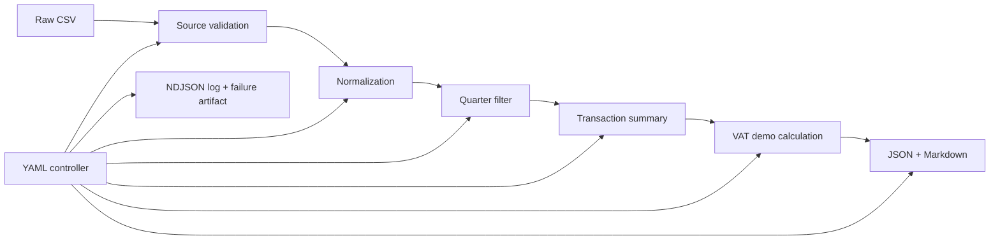

# AI Accountant Orchestra

[](https://github.com/BrysinSS/ai-accountant-orchestra/actions/workflows/ci.yml)

A small YAML-driven engineering demonstration for deterministic transaction processing. Despite the repository name, this is not a complete accountant, a tax-compliance product or an LLM system.

## Problem

Transaction workflows are difficult to verify when validation, filtering, calculation and failures are implicit. This project makes one narrow workflow inspectable through explicit recipe steps, JSON/Markdown artifacts, NDJSON logs, process exit codes and automated tests.

## What it does

The included `btw_return.yml` demonstration:

1. loads raw CSV rows;
2. validates the named source schema;
3. normalizes fields to a five-column internal schema;
4. filters an inclusive `Qn-YYYY` calendar quarter;
5. summarizes only selected transactions;
6. applies configured category rates as a VAT calculation demonstration;
7. writes JSON and Markdown artifacts;
8. writes an NDJSON record for every executed step.

Mandatory validation, invalid periods, empty periods and execution exceptions stop dependent work and return a non-zero CLI exit code.

## Architecture



Validation deliberately happens before normalization because `kaggle_grocery_v1` names raw source columns. The existing `load_dataframe()` import remains available as a load-and-normalize convenience API.

## Reproducible demo

Python 3.11 and 3.12 are the tested CI versions.

```bash
git clone https://github.com/BrysinSS/ai-accountant-orchestra.git
cd ai-accountant-orchestra
python -m venv .venv
# Windows: .venv\Scripts\activate
# macOS/Linux: source .venv/bin/activate
python -m pip install -r requirements.txt
python main.py --recipe recipes/btw_return.yml --params period=Q3-2024
```

The included dataset has four Q3 2024 rows. The resulting `workspace/summary_latest.json` contains:

```json
{
  "period": "Q3-2024",
  "n_transactions": 4,
  "gross_revenue": 5.9,
  "net_revenue": 5.41,
  "vat_total": 0.49,
  "kor_applied": false
}
```

The full file also contains returns, category groups and the low/high VAT breakdown. Runtime artifacts are intentionally ignored by Git.

An intentional empty-period failure is reproducible:

```bash
python main.py --recipe recipes/btw_return.yml --params period=Q2-2023
```

It returns exit code `1`, stops at `filter_period`, writes a failure JSON artifact and does not run summary or VAT steps.

## Tests and CI

```bash
python -m pytest -q
```

The suite covers quarter parsing/boundaries, source validation, normalization, controller dependencies and continuation, CLI exit codes, VAT/KOR demonstration boundaries, artifacts, ordered NDJSON logs, one successful end-to-end run and one end-to-end failure. GitHub Actions installs dependencies cleanly and runs the suite on Python 3.11 and 3.12.

## Engineering decisions

- Recipes are trusted code configuration: function imports are dynamic, so untrusted recipes must not be executed.
- Invalid validation reports are failed steps by default. Explicit `continue_on_error` produces `PARTIAL_SUCCESS`, never `OK`.
- pandas/numpy floats are acceptable inside this small data workflow. Reported monetary values use Decimal `ROUND_HALF_UP` to two places at the calculation/reporting boundary.
- The quarter is calendar-based, timezone-naive and inclusive at both boundaries.
- The main recipe explicitly disables the simplified KOR switch because a quarter of demo rows cannot establish annual eligibility.
- `--ask` is only a regex convenience for extracting an explicit quarter; it is not LLM functionality.

## Limitations

- The VAT output demonstrates configured gross-inclusive arithmetic; it is not an official BTW return and is not suitable for filing.
- Category mappings and the legacy 2025 rules file are example configuration, not verified current tax guidance.
- The simplified KOR function is preserved for tests/API compatibility only and does not model legal eligibility.
- There are no bank connections, bookkeeping ledger, invoice model, tax submission, authentication or implemented agent/LLM workflow.
- Excel/JSON loaders remain available through the existing loader, but the documented end-to-end recipe is verified with CSV only.

See [ENGINEERING_BASELINE.md](ENGINEERING_BASELINE.md), [docs/ARCHITECTURE.md](docs/ARCHITECTURE.md) and [docs/ENGINEERING_EVIDENCE.md](docs/ENGINEERING_EVIDENCE.md).

## License

[MIT](LICENSE)
