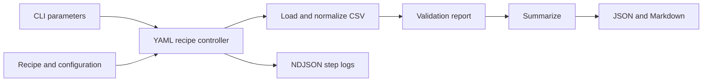

# AI Accountant Orchestra

A YAML-driven deterministic recipe engine for loading, normalizing and summarizing transactions, with separate Dutch VAT/BTW and simplified KOR calculation functions.

[](https://github.com/BrysinSS/ai-accountant-orchestra/actions/workflows/ci.yml)

## Problem

Transaction processing needs a visible sequence of transformations, consistent data fields and inspectable outputs. This project expresses that sequence in YAML and runs Python functions with step-level logs.

## What it does

- Loads CSV data into normalized pandas DataFrames.
- Resolves recipe parameters and prior-step results at execution time.
- Produces category/month summaries and JSON/Markdown artifacts.
- Provides separately tested VAT/BTW calculations and simplified KOR threshold behavior.
- Writes NDJSON logs with step status and duration, plus error artifacts for exceptions.

## Architecture



This is the bundled summary recipe's flow. VAT calculations are implemented in [tax.py](tools/analysis/tax.py) and tested separately; the recipe does not call them.

## Engineering decisions

[The controller](orchestrator/controller.py) runs steps in order, resolves typed parameters lazily and records results for later steps. Exceptions stop execution by default, with configurable continuation. A returned validation report is ordinary data: `valid: false` does not itself stop the controller.

Recipes import Python functions dynamically. Run only recipes you trust. The `--ask` path uses regular expressions to parse a period; it is not an LLM integration. Generic agent steps remain unimplemented.

## Quick start

Use Python 3.11 (the CI version) or Python 3.12 (used for this portfolio verification). Run commands from the repository root.

```bash
git clone https://github.com/BrysinSS/ai-accountant-orchestra.git
cd ai-accountant-orchestra
python -m venv .venv
```

Activate the environment:

```powershell
# Windows PowerShell
.\.venv\Scripts\Activate.ps1
```

```bash
# macOS / Linux
source .venv/bin/activate
```

Then install and run:

```bash
python -m pip install -r requirements.txt
python -c "from ui.cli import main"
python main.py --recipe recipes/test_load.yml
python main.py --recipe recipes/btw_return.yml --params period=Q3-2025
python -m pytest -q
```

The import check detects missing CLI dependencies before the entry point can fall back to its skeleton runner. The second recipe writes `workspace/summary_latest.json`, `workspace/summary_latest.md` and a timestamped log under `workspace/logs/`. It overwrites the latest summary files.

## Real input and output

Input excerpt from [the included demo CSV](data/demo_transactions.csv):

```csv
customer_id,store_name,transaction_date,aisle,product_name,quantity,unit_price,total_amount,discount_amount,final_amount,loyalty_points
2824,GreenGrocer Plaza,2023-08-26,Produce,Pasta,2,7.46,14.92,0.00,14.92,377
```

Summary excerpt from the full ten-row demo run (not just the one row above):

```json
{
  "n_transactions": 10,
  "gross_revenue": 42.269999999999996,
  "net_revenue": 42.269999999999996,
  "returns": {"n": 1, "sum": -1.0}
}
```

See the [recorded full summary](workspace/summary_latest.json). The floating-point representation is preserved from the actual output.

## Testing and CI

Eight existing pytest tests cover loader columns/types, grouping, VAT calculations, rule loading and KOR zeroing. [Tests](tests) and [GitHub Actions configuration](.github/workflows/ci.yml) are public. CI installs requirements and runs pytest on Python 3.11 for main-branch pushes and pull requests.

These are focused function tests. They do not establish correct tax filing, end-to-end recipe validation or LLM behavior.

## Project structure

| Path | Responsibility |
|---|---|
| [main.py](main.py), [ui/cli.py](ui/cli.py) | Entry point and CLI |
| [orchestrator/controller.py](orchestrator/controller.py) | Recipe execution and logs |
| [recipes](recipes), [config.yaml](config.yaml) | Steps, inputs and column mapping |
| [tools/data_io](tools/data_io) | Loading and artifact export |
| [tools/analysis](tools/analysis) | Summaries and tax calculations |
| [tools/validation/schema.py](tools/validation/schema.py) | Column-presence reports |
| [rules](rules), [templates/reports](templates/reports) | Demonstration rules and report templates |
| [tests](tests), [.github/workflows/ci.yml](.github/workflows/ci.yml) | Tests and CI |

## Limitations and status

Executable transaction-processing demonstration with tested calculation functions.

- `btw_return.yml` summarizes all input rows; the period labels the report and does not filter transaction dates.
- That recipe hardcodes `kor_applied: true` and zero VAT metadata. It is not an automated tax return.
- Its schema check expects source columns but receives normalized columns, so the demo reports `valid: false` while the overall result remains `OK`.
- CLI exit code alone is insufficient: inspect status, validation results, artifacts and NDJSON logs.
- KOR logic and the 2025 rules file are simplified demonstration behavior, not a verified current tax-compliance implementation.
- No bank integration, tax submission or implemented LLM accounting is claimed.

## License

[MIT](LICENSE).


