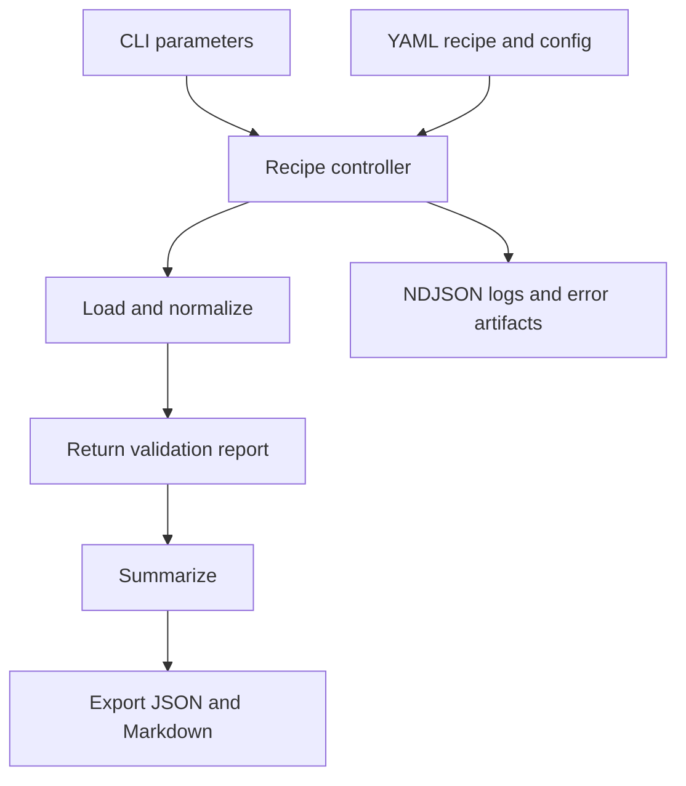

# Recipe execution architecture

[The controller](../orchestrator/controller.py) calls the Python functions named in each recipe. Parameters can refer to previous step results. Exceptions fail the run by default; continuation can be configured.

The bundled [BTW recipe](../recipes/btw_return.yml) runs loading, validation, summary and rendering. It does not invoke [the VAT functions](../tools/analysis/tax.py). Its tax metadata is fixed demonstration data.

Validation currently checks column presence and returns a report. The normalized DataFrame lacks the original schema's column names, so the demo returns `valid: false`. The controller does not treat that boolean as a failed gate.

The `--ask` route parses period text with regex. Generic agent steps are no-ops. No implemented LLM processing is claimed.

[Quick start and limitations](../README.md).

